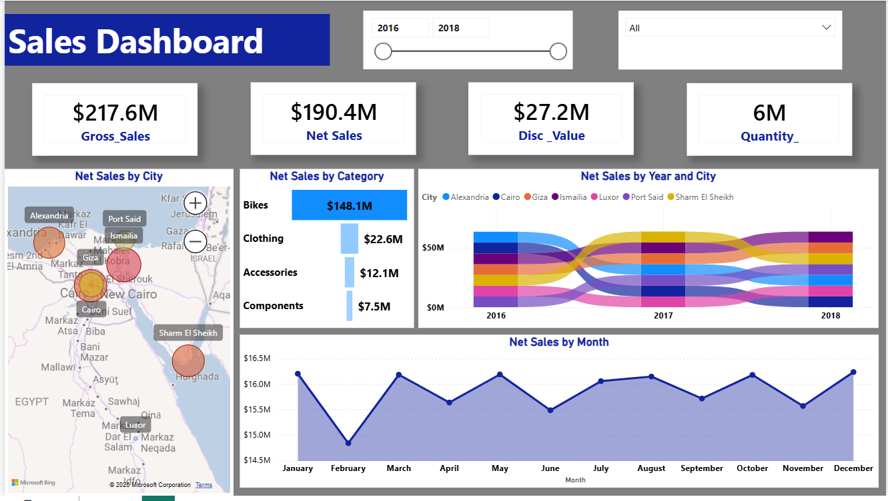

# 📊 Sales Performance Analysis Dashboard

An interactive Power BI dashboard designed to track and analyze sales performance, regions, and product categories using an MS Access database as the primary source.

## 🚀 Project Overview
This project transforms raw sales data into actionable insights. It helps business owners understand:
* **Top Performing Cities:** Which regions generate the most revenue.
* **Category Analysis:** Sales distribution across Bikes, Clothing, and Accessories.
* **Time Trends:** Sales growth and fluctuations over the years.

## 🛠️ Tools & Technologies
* **Power BI:** Data Visualization & Modeling.
* **MS Access:** Relational Database source.
* **DAX:** Calculated measures for KPIs (Net Sales, Gross Sales, etc.).

## 📁 Files & Links
Due to GitHub file size limits, you can access the full project files below:
* **Download Power BI (.pbix):https://drive.google.com/file/d/1GxM1emhkdvoxqaNuGqpKS4SXGUeG9N6T/view?usp=sharing
* **Download Database (.accdb):https://drive.google.com/file/d/1htlBxx30nfwGPwFdsy3cqBbHy_SJUE-k/view?usp=sharing
## 📸 Dashboard Preview

